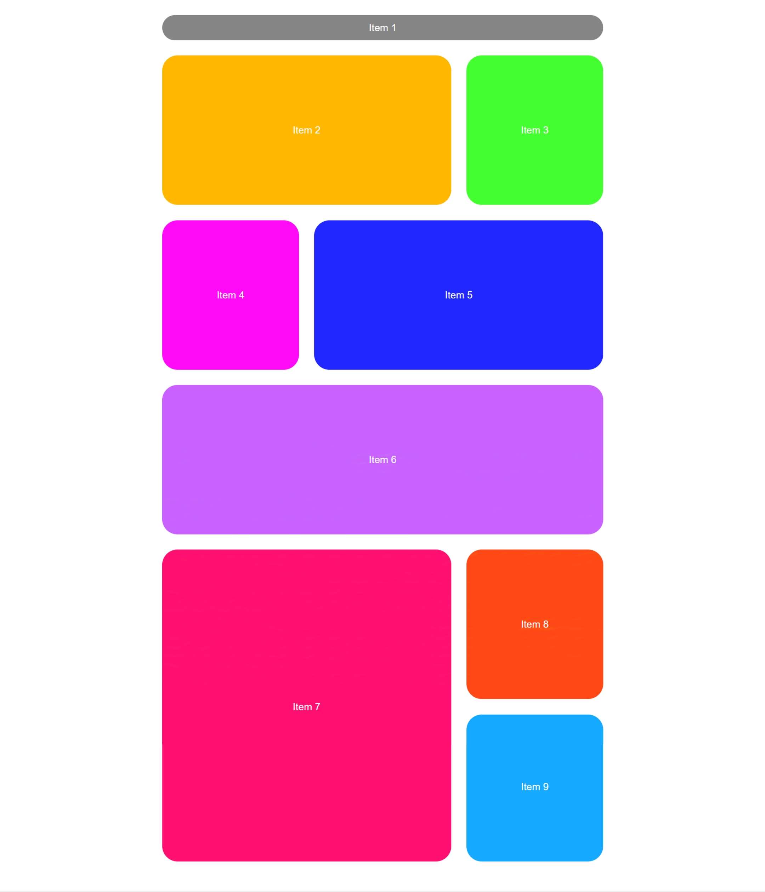

# css-grid-layout

This project demonstrates a CSS Grid-based layout with multiple items arranged in a flexible and responsive grid system.

## Features

- Uses CSS Grid to display 9 items.
- The grid layout adapts to different screen sizes.
- Smooth transition effect applied to the grid items.
- Each grid item has a unique background color.

## Project Structure

- **HTML**: Defines the structure of the grid with 9 items inside a container.
- **CSS**: Styles the grid layout, specifying the number of rows and columns, along with gap spacing and transition effects.

## How to Use

1. Clone the repository.
   ```bash
   git clone https://github.com/praveenjadhav1510/grid-layout-project.git
   ```
2. Navigate to the project directory.
   ```bash
   cd grid-layout-project
   ```
3. Open the `index.html` file in your browser.

## Technologies Used

- HTML5
- CSS3 (CSS Grid)

## License

This project is licensed under the MIT License - see the [LICENSE](LICENSE) file for details.

## Example

Below is a screenshot of the grid layout in action:



### Webpage link: https://praveenjadhav1510.github.io/css-grid-layout
